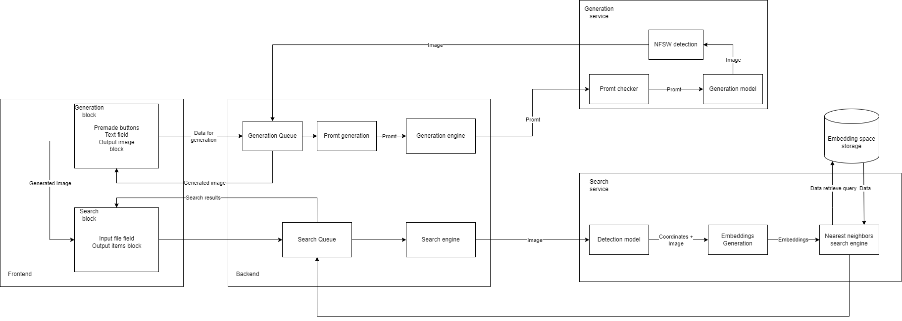

# StyleForge
## Introduction
Introducing our service that utilizes the power of neural networks to generate unique and personalized clothing styles for you. Our service takes into account your preferences to create styles that perfectly suit your individual taste and needs. With the help of our advanced algorithms, we can search through a vast selection of online shops and recommend clothing items that match your generated style, saving you time and effort in the shopping process. Our service combines the best of technology and fashion to provide you with a seamless and enjoyable shopping experience. Try it out today and revolutionize the way you shop for clothes!

## Description
Our service consists of 2 parts: generation engine and search engine.

### Generation engine
In development.
### Search engine
For a search engine we solve two task: detection of a clothing item on image and metric learning task, on a database of images from DeepFashion 2 dataset. 
In fututre we plan to implement parsing online stores and showing users links to existing webpages with clothes.

## Datasets
### Generation
1. [Fashion-MMT](https://github.com/syuqings/Fashion-MMT)
2. [FashionGen](https://arxiv.org/pdf/1806.08317v1.pdf)
### Detection
1. [DeepFashion](http://mmlab.ie.cuhk.edu.hk/projects/DeepFashion.html)
2. [DeepFashion2](https://github.com/switchablenorms/DeepFashion2)
### Metric Learning 
1. [DeepFashion](http://mmlab.ie.cuhk.edu.hk/projects/DeepFashion.html)
2. [DeepFashion2](https://github.com/switchablenorms/DeepFashion2)

## Architecture draft

